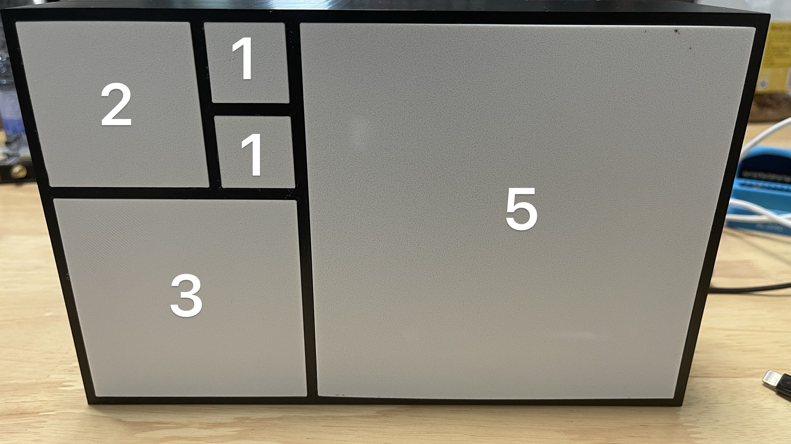
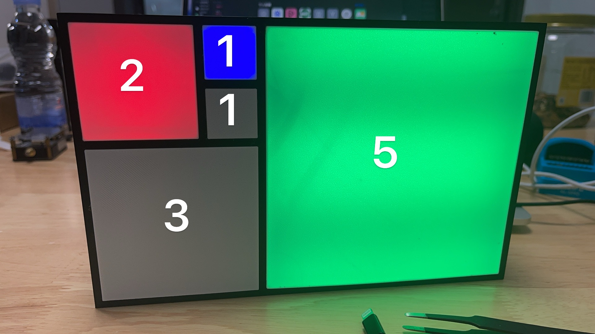

# Fibonacci Clock - Improved Version  
(Raspberry Pi Pico W + MicroPython)

A beautiful time-telling clock that uses the Fibonacci sequence to display hours and minutes with colorful WS2812B LEDs on a Raspberry Pi Pico W running MicroPython.

**Inspired by**  
[NerdCave.xyz - Fibonacci Clock](https://nerdcave.xyz/docs/projects/fibonnaci-clock/)  

**My Improvements**  
- Startup WiFi connection animation (color sweep across segments) with configurable timeout and error indication (yellow LEDs on failure)  
- Real-time brightness control using two physical buttons (GPIO6 = decrease, GPIO7 = increase, 0.1 steps from 0.0–1.0)  
- Fully configurable via `config.json` (WiFi credentials, timezone, default brightness, LED counts per segment, animation enable/disable, custom animation colors, NTP host, etc.)  
- Robust error handling, debug prints via serial console, and NTP sync with automatic retries  
- Support for both multi-pin (independent data lines per segment) and single-pin (daisy-chained) LED wiring modes  
- Code refactoring for better readability: property-based brightness, modular classes, and clamp/type safety

The core Fibonacci logic (1-1-2-3-5 squares), color rules (Red = hours, Blue = minutes, Green = overlap), and 12-hour display remain faithful to the original for compatibility.

## Features

- Displays time in 12-hour format using five Fibonacci squares  
- Minutes shown in 5-minute increments (0–59 → 0–11 internally)  
- WiFi + NTP time sync (default: Aliyun server for fast China access)  
- Adjustable LED brightness via buttons  
- Optional startup animation (enable/disable, custom RGB colors)  
- Offline fallback if WiFi/time sync fails  

## Required Hardware

- Raspberry Pi Pico W (WiFi-enabled)  
- WS2812B/SK6812 addressable LED strips (example total ~53 LEDs: 32 + 12 + 5 + 2 + 2)  
- Two push buttons (GPIO6 & GPIO7, internal pull-up)  
- 5V power supply (≥2A recommended for full brightness)  
- Custom PCB (reference below)  
- 3D-printed enclosure (files in `stl/`)  

## Software Requirements

- MicroPython firmware for Pico W (latest stable)  
- Built-in libraries: `neopixel`, `network`, `ntptime`, `ujson`, `machine`, `time`  

## Installation & Usage

1. Flash MicroPython UF2 to your Pico W (hold BOOTSEL while connecting USB).  
2. Edit `config.json` with your WiFi SSID/password and timezone (do **not** commit real credentials!).  
3. Upload files to Pico W root using Thonny, rshell, or ampy:  
   - `main.py` (auto-runs on boot)  
   - `config.json`  
4. Power on → observe startup animation while connecting to WiFi.  
5. Time syncs automatically → clock starts displaying current time.  
6. Press GPIO6 to decrease brightness, GPIO7 to increase.  

**Debug tip**: Connect Thonny serial console to see logs (WiFi status, NTP results, brightness changes, errors).

## How to Read the Fibonacci Clock

At first glance it looks abstract, but it's simple once you know the rules.

### 1. The Five Blocks
The clock uses five squares with Fibonacci values: 1, 1, 2, 3, 5.

  
*Example of the five blocks and their values*

### 2. Color Meanings
- **Red** → Contributes to **hours** only  
- **Blue** → Contributes to **minutes** only  
- **Green** → Contributes to **both** hours and minutes  
- **Off (black)** → Not used for current time  

### 3. Reading Hours
Add the values of all **red** and **green** blocks.  
Hours = sum(red + green)  
(12-hour format: 12 = 0)

### 4. Reading Minutes
Add the values of all **blue** and **green** blocks.  
Multiply by 5.  
Minutes = (blue + green) × 5

### 5. Example
  
*Red block: 2*  
*Blue block: 1*  
*Green block: 5*  

→ Hours = 2 (red) + 5 (green) = **7**  
→ Minutes = (1 (blue) + 5 (green)) × 5 = **30**  
**Time shown: 7:30**

## Enclosure (STL) & PCB Files

### 3D-Printable Enclosure (STL)
Files are in the [`stl/`](stl/) folder.

Improvements over original concept:
- Tighter fit tolerance for easier assembly  
- Added optional back cover (dust protection & aesthetics)  
- Optimized diffuser thickness/angle for even light spread  
- Most parts print without supports  

**Print settings**:
- Material: PLA or PETG  
- Layer height: 0.2 mm  
- Infill: 15–20%  
- Supports: Usually not needed  

### PCB (WS2812B Controller)
Layout is **based on the original** by Guitarman9119.

**Original PCB files**:  
Files are in the [`pcb/`](pcb/) folder.

https://github.com/Guitarman9119/Raspberry-Pi-Pico-/tree/main/WS2812B%20Controller

## License

MIT License – see the [LICENSE](LICENSE) file for details.  
Feel free to use, modify, and share (with credit to originals and myself).

Star ⭐ if you like it, and feel free to fork/PR!

Last updated: February 2026  
