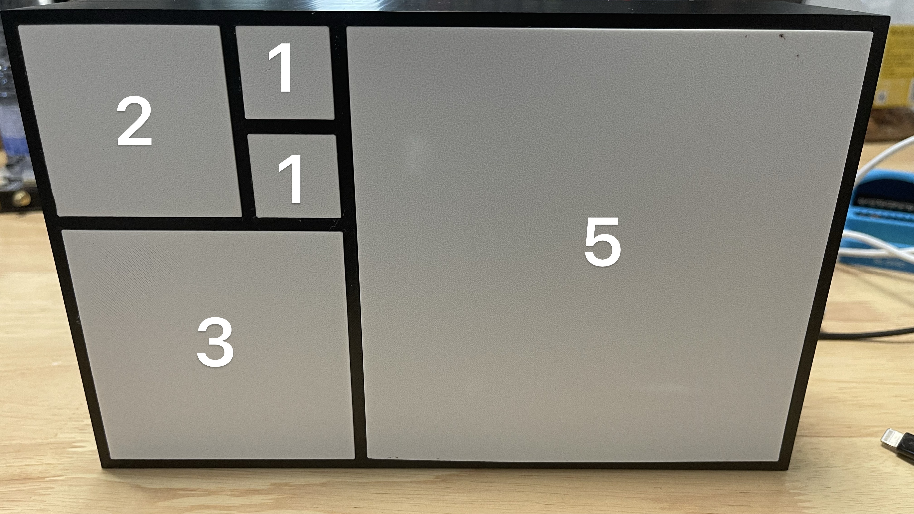
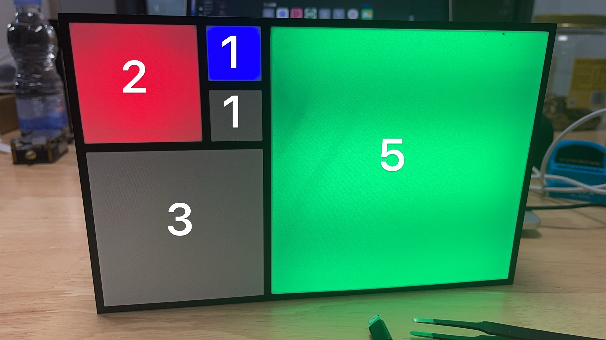

# Fibonacci Clock - Improved Version  
(Raspberry Pi Pico W + MicroPython)

A beautiful time-telling clock that uses the Fibonacci sequence to display hours and minutes with colorful WS2812B LEDs on a Raspberry Pi Pico W running MicroPython.

**Inspired by**  
[NerdCave.xyz - Fibonacci Clock](https://nerdcave.xyz/docs/projects/fibonnaci-clock/)  

**What's new in this version**
- Startup animation – a color sweep runs across the squares while the Pico connects to WiFi. If it can't connect, all squares turn yellow for 2 seconds and the clock continues offline.
- Config first, safe defaults second – settings are read from config.json. Keys you leave out keep their default, and an invalid value only resets that one key.
- Responsive brightness buttons – buttons are checked every 20 ms. Press once for one step, or hold to keep changing. Brightness never goes fully dark.
- Brightness is remembered – 5 seconds after you stop pressing, the level is saved to state.json and restored on the next boot.
- Random patterns – most times can be shown in several ways (6 = 5+1, 3+2+1, 3+1+1…). Like the original clock, one of them is picked at random each time the display changes.
- Keeps accurate time – the time is re-synced over NTP every 6 hours. If it has never synced, the Pico retries every 5 minutes and flashes yellow every 30 seconds to warn you.
- Night mode – from 23:00 to 07:00, brightness is capped at a lower level.
- Gamma correction – brightness steps look even to the eye, including at the low end.
- Optional watchdog – if the program ever freezes, the Pico reboots itself automatically.
- Simpler hardware – one data line per square (the single-pin daisy-chain mode has been removed), and fewer LEDs: 16 + 4 + 2 + 1 + 1 = 24.

## Features

- Displays time in 12-hour format using five Fibonacci squares  
- Minutes shown in 5-minute increments (0–59 → 0–11 internally)  
- WiFi + NTP time sync (default: Aliyun server for fast China access)  
- Adjustable LED brightness via buttons  
- Optional startup animation (enable/disable, custom RGB colors)  
- Offline fallback if WiFi/time sync fails  

## Required Hardware

- Raspberry Pi Pico W (WiFi-enabled)  
- WS2812B/SK6812 addressable LED strips (example total ~53 LEDs: 32 + 12 + 5 + 2 + 2)  
- Two push buttons (GPIO6 & GPIO7, internal pull-up)  
- 5V power supply (≥2A recommended for full brightness)  
- Custom PCB (reference below)  
- 3D-printed enclosure (files in `stl/`)  

## Software Requirements

- MicroPython firmware for Pico W (latest stable)  
- Built-in libraries: `neopixel`, `network`, `ntptime`, `ujson`, `machine`, `time`

## Configuration
 
`config.json` only needs the keys you want to change; any key you leave out uses its default.
 
The settings are applied in this order (highest priority first):
 
1. `state.json` – brightness saved from the buttons
2. `config.json`
3. Defaults built into `main.py`
> If you've adjusted brightness with the buttons, changing `brightness` in `config.json` won't have any effect. Delete `state.json` from the Pico to go back to the config value.
 
| Key | Default | Description |
|---|---|---|
| `wifi_ssid` / `wifi_password` | `""` | WiFi credentials. If left empty, the clock runs offline |
| `timezone_offset_hours` | `8` | UTC offset in hours; decimals work, e.g. `5.5` |
| `ntp_host` | `"ntp.aliyun.com"` | NTP server (fast in China) |
| `ntp_resync_hours` | `6` | Time between NTP re-syncs |
| `layout_led_counts` | `[16,4,2,1,1]` | Number of LEDs in each square |
| `segment_order` | `[5,3,2,1,1]` | Value of each square |
| `pins` | `[1,2,3,4,5]` | Data pin of each square |
| `button_down_pin` / `button_up_pin` | `6` / `7` | Brightness button pins |
| `brightness` | `0.8` | Starting brightness (0.1–1.0) |
| `min_brightness` | `0.1` | Lowest brightness the buttons can reach |
| `brightness_step` | `0.1` | Change per button press |
| `gamma` | `2.2` | Gamma correction; `1.0` turns it off |
| `night_mode` | `true` | Dim the clock at night |
| `night_start_hour` / `night_end_hour` | `23` / `7` | Night period |
| `night_brightness` | `0.2` | Maximum brightness at night |
| `random_patterns` | `true` | Pick a random pattern among the equivalent ones |
| `enable_startup_animation` | `true` | Show the WiFi animation at boot |
| `startup_colors` | red, green, blue | Colors used by the animation, as `[R,G,B]` values |
| `startup_timeout_seconds` | `60` | How long to wait for WiFi before going offline |
| `enable_watchdog` | `false` | Automatic reboot if the program freezes |
 
`pins`, `layout_led_counts` and `segment_order` must all have the same length. If they don't, all three fall back to their defaults.
 
### About the watchdog
 
When enabled, the Pico reboots on its own if the program stops responding for 8 seconds. It is off by default because stopping the program from Thonny also triggers a reboot. Turn it on after you've finished testing and the clock is running 24/7.

## Installation & Usage

1. Flash MicroPython UF2 to your Pico W (hold BOOTSEL while connecting USB).  
2. Edit `config.json` with your WiFi SSID/password and timezone (do **not** commit real credentials!).  
3. Upload files to Pico W root using Thonny, rshell, or ampy:  
   - `main.py` (auto-runs on boot)  
   - `config.json`  
4. Power on → observe startup animation while connecting to WiFi.  
5. Time syncs automatically → clock starts displaying current time.  
6. Press GPIO6 to decrease brightness, GPIO7 to increase.  

**Debug tip**: Connect Thonny serial console to see logs (WiFi status, NTP results, brightness changes, errors).

## How to Read the Fibonacci Clock

At first glance it looks abstract, but it's simple once you know the rules.

### 1. The Five Blocks
The clock uses five squares with Fibonacci values: 1, 1, 2, 3, 5.

  
*Example of the five blocks and their values*

### 2. Colors
 
| Color | Counts for |
|---|---|
| 🟥 Red | hours |
| 🟦 Blue | minutes |
| 🟩 Green | hours **and** minutes |
| ⬛ Off | nothing |
 
### 3. Hours
 
Add up the **red + green** squares. The clock uses the 12-hour format, so noon and midnight show **12**, with all five squares red.
 
### 4. Minutes
 
Add up the **blue + green** squares and **multiply by 5**. The clock moves in 5-minute steps, so 7:34 is shown as 7:30.

### 5. Example
  
*Red block: 2*  
*Blue block: 1*  
*Green block: 5*  

→ Hours = 2 (red) + 5 (green) = **7**  
→ Minutes = (1 (blue) + 5 (green)) × 5 = **30**  
**Time shown: 7:30**

### Status lights
 
| What you see | Meaning |
|---|---|
| Red/green/blue sweep | Starting up, connecting to WiFi |
| All yellow for 2 s | WiFi failed or not configured, running offline |
| Short yellow flash every 30 s | Time has not been synced, so the displayed time may be wrong |

## Enclosure (STL) & PCB Files

### 3D-Printable Enclosure (STL)
Files are in the [`stl/`](stl/) folder.

Improvements over original concept:
- Tighter fit tolerance for easier assembly  
- Added optional back cover (dust protection & aesthetics)  
- Optimized diffuser thickness/angle for even light spread  
- Most parts print without supports  

**Print settings**:
- Material: PLA or PETG  
- Layer height: 0.2 mm  
- Infill: 15–20%  
- Supports: Usually not needed  

### PCB (WS2812B Controller)
Layout is **based on the original** by Guitarman9119.

**Original PCB files**:  
Files are in the [`pcb/`](pcb/) folder.

https://github.com/Guitarman9119/Raspberry-Pi-Pico-/tree/main/WS2812B%20Controller

## License

MIT License – see the [LICENSE](LICENSE) file for details.  
Feel free to use, modify, and share (with credit to originals and myself).

Star ⭐ if you like it, and feel free to fork/PR!

Last updated: February 2026  
